## Cascades Spring 2017

*June 12, 2017*

After returning to New Haven following my March trip to the Cascade Mountains[^3], I promised myself I wouldn't plan another climbing trip until I found a job for the summer, worried that my obsession with alpine climbing was becoming destructive and blinding me to other things I could be doing with my time. Long story short, I found a great job for the summer which I can't wait to begin, and feel as though I've figured out a way to work towards my dreams in the mountains while also living a healthier, more balanced life. In celebration of this, I (of course) planned an extended alpine climbing vacation to the Cascade Mountains in the interim between the end of my semester at school and the beginning of my job. As I sit here in my grandparents' quiet, peaceful home in Ballard, reflecting on the last several weeks, I feel incredibly lucky with how the trip worked out, and wanted to take the time to write down some of the memories.

[^3]: Riley wrote up an account of this trip on his [blog](http://rjrice.com/cascades-take-two/), and I wrote [a](https://www.instagram.com/p/BSFIXdghIli2N84cpcI10ZlYkdcZH9qxQhGUeM0/) [few](https://www.instagram.com/p/BSkh9pjhdyBAWaz1Gv3d8To-mby1P2fJAOtWJc0/) [instagrams](https://www.instagram.com/p/BTKXqmUhlUNgG4jNWnR-ieaKC8KczPlAxwqOxM0/) and a [CC.com TR](http://cascadeclimbers.com/forum/ubbthreads.php?ubb=showflat&Number=1154616)

All in all, I enjoyed a successful climbing trip, facilitated by the opportunity to tie in with several good friends, a long streak of mostly stable, sunny weather, and the experience gained from several prior trips to the Cascades. I didn't do as much climbing with ice tools and steel crampons as I had wanted to do, and ended up backing off of several routes I really wanted to climb, but I honestly consider this a perk of alpine climbing: when I eventually return to complete these objectives, I will only be a better and more experienced alpinist.

Throughout the sixteen days of the trip, I climbed with five different friends, took only two full rest days, and had no car of my own. This trip, as short as it was, felt like a bit of a marathon, and I had to be extra attentive to my physical and mental health to make sure that I wouldn't be coming home with overuse injuries, or burnout from too much climbing-related stress (after all, this was supposed to be a vacation). Configuring a trip in this fashion also required flexibility and the help of many others, and so I owe a huge thank you to my parents, grandparents, Spike and his family, Emma and her family, Riley and his poor vehicle, Grace and her family, Ilana, and Shomari for tying in with me, housing me, transporting me and my cumbersome belongings, and tolerating my hectic schedule.

Because this trip report is so long, I've organized it into five sections, comprising the following alpine adventures:

___

**Kulsan and Tahoma with Spike**  
*(attempt)* Kulshan/Mount Baker, Coleman Headwall, III+ AI3 50˚, 700m  
Index: Aires 5.8+ 5p, Thin Fingers 5.11-, Tatoosh 5.10-  
Tahoma/Mount Rainier, Kautz Glacier, III 50˚, 2700m, *with Spike Sievert*  

**Outer Space Storm with Emma**  
Snow Creek Wall, Outer Space, III 5.9+, 7 pitches, *with Emma Spence*  
3 O'Clock Rock, Total Soul, III 5.10b, 8 pitches, *with Emma Spence*  

**Mount Stuart, Aasgard Pass Tragedy, and Acid Baby with Riley, Ilana, and friends**  
*(attempt)* Mount Stuart, Complete North Ridge, IV 5.9, 900m  
Aasgard Sentinel, Acid Baby, III 5.10d, 8 pitches, *with Ilana Zimmerman*  

**Solo in the Enchantments: Colchuck Col Buttress, Colchuck Glacier, and Colchuck Peak**  
Colchuck Col Buttress, unknown route, II 45˚ 5.6, 200m; *solo*  
Colchuck Glacier, ski descent  
*(attempt)* Colchuck Peak, North Buttress Couloir, II 50deg, 400m  

**West Face of Colchuck Balanced Rock with Steve**  
Colchuck Balanced Rock, West Face, IV 5.11c/5.11a C1, 300m, *with Stephen Snell*  

___

**Kulsan and Tahoma with Spike**  

When Riley and I climbed the North Ridge of Kulshan last summer, I couldn't help but notice the line's obvious big sibling: the Coleman Headwall, a direct line to the summit consisting of 2500 feet of alpine ice and snow, just west of the North Ridge. When I saw it in early August 2016, this route was in horrendous condition, a jumble of dangerous seracs threatened by loose volcanic rock. I knew from research that early in the season, the route is exposed to far less objective hazard: the seracs are mostly buried in snow (supposedly making them safer) and rockfall is less frequent, owing to snow cover and colder temperatures. With the Cascades receiving around 130-150% of normal snowfall this previous winter[^4], it seemed obvious to me that with good weather in the week prior, the route would be in excellent condition during the first week of my trip. I touched down to SeaTac around 9pm on the 24th, and the weather of the preceding few days had been nearly perfect for this objective: the freezing levels had been hovering around 10-12,000ft with sunny weather, and then had dramatically dropped to 7000ft, virtually guaranteeing that the snow on-route would be of the firm, styrofoam quality one desires for climbing long, sustained slopes such as the Coleman Headwall. Spike picked me up and we agreed this was for sure our best chance at the route. We drove straight away to the Heliotrope Ridge trailhead to begin a single-push ascent of the route - ain't no rest for the wicked!

[^4]: The USDA records data about snowfall. If you visit this [map](http://www.wcc.nrcs.usda.gov/webmap_beta/#version=76&elements=&networks=!&states=WA&counties=!&hucs=&minElevation=&maxElevation=&elementSelectType=all&activeOnly=true&activeForecastPointsOnly=false&hucLabels=false&hucParameterLabels=false&stationLabels=&overlays=&hucOverlays=&mode=data&openSections=dataElement,parameter,date,basin,elements,location,networks&controlsOpen=true&popup=&base=esriNgwm&displayType=station&basinType=6&dataElement=WTEQD&parameter=OBS&frequency=DAILY&duration=3&customDuration=&dayPart=E&year=2017&month=1&day=22&monthPart=E&forecastPubMonth=1&forecastPubDay=1&forecastExceedance=50&seqColor=1&divColor=3&scaleType=D&scaleMin=&scaleMax=&referencePeriodType=POR&referenceBegin=1981&referenceEnd=2010&minimumYears=20&hucAssociations=true&lat=46.842&lon=-118.301&zoom=7) you can explore various data from SNOTEL stations, relative to past years' data

We drove the car up Glacier Creek Road until we could go no further, and then began to hike and skin the rest of the road to the trail itself around 1 or 2am. It was at this moment that I realized my ski setup was totally incompatible with the boots I had chosen to fly out for the trip - my new pair of summer mountaineering boots, lacking a front toe welt, had no way to interface with the wire bail used by my Silvretta 500 binding.[^5] I was aghast at myself for the silly mistake and felt determined to make something work. A few minutes and four ski straps later, I had come up with an extremely improvisational (read: janky as all hell) method of securing the front of my boot to the binding which appeared to at least allow for uphill skinning.

[^5]: The Silvretta 500 binding continues to be the binding of choice for interfacing skis with mountaineering boots, thus obviating the need to carry two pairs of boots when the climbing expected demands greater ankle flexibility than can be achieved wearing Alpine Touring boots. The combination of the binding with "Tip Cordz" was popularized by Colin Haley in the early 2000s, and more information on this setup can be found on an old Cascade Climbers [article](http://cascadeclimbers.com/articles/colin-haley-alpinism-equipment-for-alpinism-in-the-greater-ranges/colin-haley-alpinism-hardware-part-three/), and on a more recent post on Petzl's [website](https://www.petzl.com/US/en/Sport/News/2017-6-5/Colin-Haley-s-Begguya-Kit#.WT8a-xPyuCQ).

As I skinned and cramponed up the lower slopes of the Coleman Glacier, Spike began to fall far behind. He's a newly minted alumni of Yale Varsity Cross Country and Track and Field, and the most cardiovascularly fit individual I've ever spent time in the mountains with, so something was obviously very wrong - usually, I struggle mightily to keep up with his pace on snowy terrain! I stopped at the top of a snow slope and sat down to wait for him. An indeterminate amount of time later, I heard a voice calling my name and opened my eyes, having fallen asleep on my pack. Turns out, the discomfort he had been feeling with his new AT boots had morphed into full-blown pain and was also causing him circulation problems with his toes. While I had been ensconced in my cat-nap, the clouds which had been hovering over the mountain all night and morning had begun to dump snow. Visibility decreased to a quarter mile, and snow began to accumulate much faster than I would have expected from a summer storm, with about an inch down in the first half-hour of precipitation. It was an obviously bad idea to commit to the route (one of the biggest, steepest avalanche slopes below the 49th parallel) in the midst of this weather, especially given Spike's feet, so we turned around and headed for the car while we still had the visibility to safely do so. On the way down, I got to try out my janky ski setup going downhill. We had been up for an absurd number of hours and, once back in Bellevue, slept for 16 hours straight while the freezing levels in the mountains climbed higher and higher.

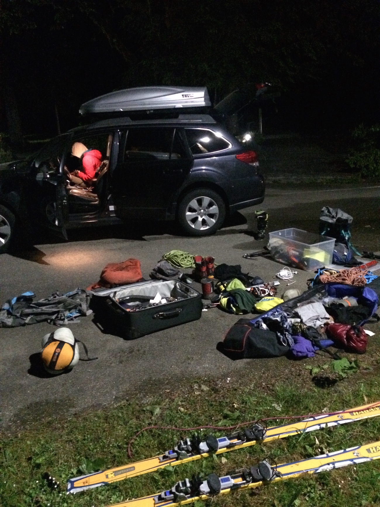  
*Sometime after midnight, Spike and I pack gear in the Glacier Ranger Station parking lot*

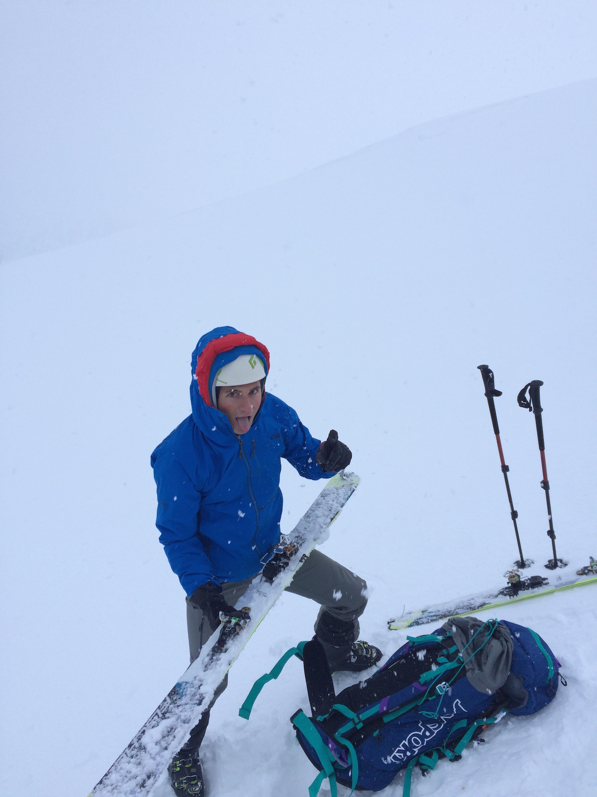  
*Spike at wherever we turned around*

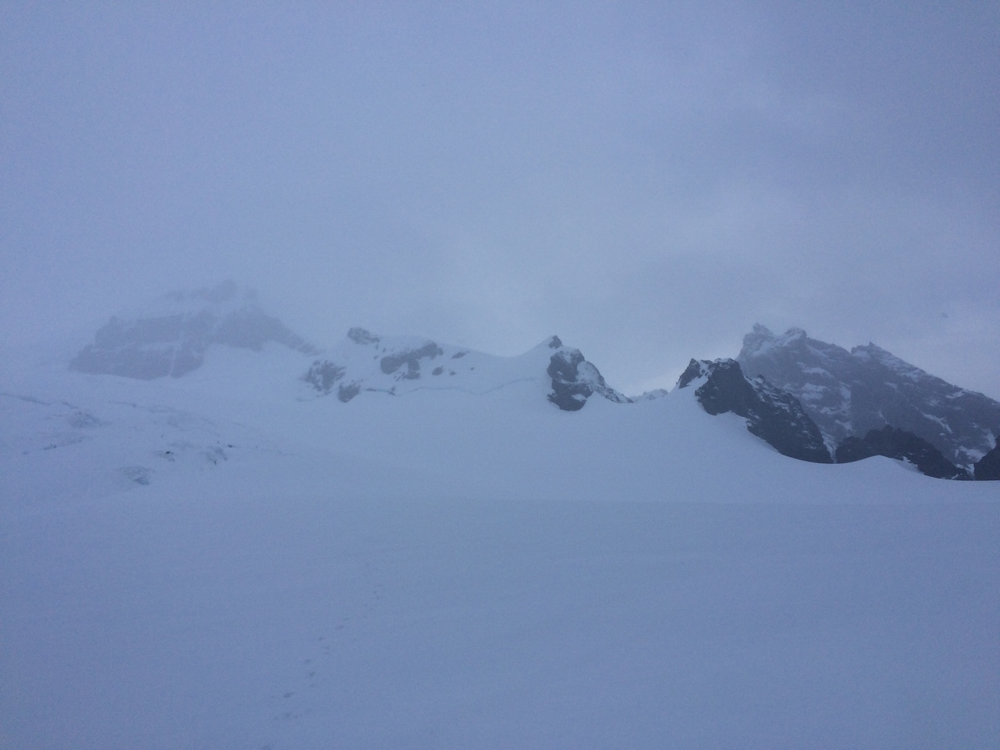  
*The beautiful and mysterious Black Buttes enveloped in storm*

  
*Descending the Coleman Glacier, with the Black Buttes behind. Credit: Spike Sievert*

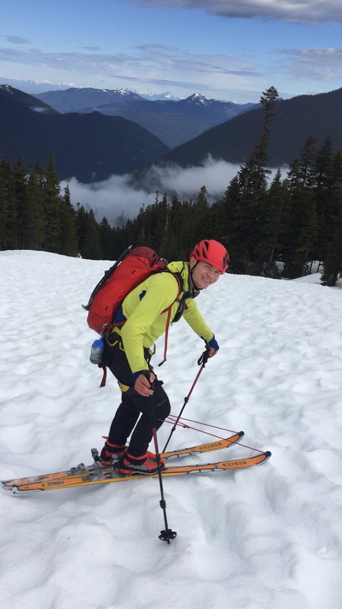  
*About to make some precarious turns on my '90's ski set up*

<iframe src="https://player.vimeo.com/video/221334217" width="360" height="640" frameborder="0" webkitallowfullscreen mozallowfullscreen allowfullscreen></iframe>

We woke up the next day and decided to attempt the Kautz Glacier on Tahoma/Mount Rainier, hoping to avoid much of the Memorial Day weekend traffic on the most popular routes, but not quite ready to attempt a route as committing as Liberty Ridge. I also hoped that the Kautz would have a few pitches of moderate alpine ice, to break up what I knew would otherwise be interminable snow slogging. On the way down to Paradise, we stopped at Index for an afternoon of cragging, where Spike did a great job onsighting his hardest lead on gear yet (a delicate undercling sequence on Aires) while I managed to onsight the "lite" version of Thin Fingers (skipping the tricky 10ft boulder problem, as granite bouldering is my kryptonite).

We arrived in Ashford that evening, shot the shit with some of Spike's fellow IMG guides, and promptly went to bed in the IMG bunkhouse. The next morning, our planned departure was unsurprisingly delayed by the climbing permit gong-show. Hoards of parties streamed into the permit office, overwhelming the two rangers on duty. Some moved quickly through the permitting process, and others frustrated the rangers by trying to use them as a trip planning resource on a busy morning ("Are there crevasses on this glacier?"). We slowly moved through and started up the mountain, under clear blue skies and mild temperatures.

We spent the rest of the day climbing up to a camp on the Turtle Snowfield at around 10,000', making good time despite soggy snow conditions, and a spontaneous 20 minute phone call I made to my grandparents, provoked by sheer fascination with the fact I still had cell reception. We wanted to camp 1,000' higher, but the snow had become quite slushy, slowing upward progress. Besides, a guided group from a few days prior had dug out a campsite 10,000', and who were we to say no to a garage-sized bivy ledge? As soon as we'd inflated our pads (quite a chore at this altitude!) and shoved them into our small bivy tent, we immediately passed out, boot-clad feet sticking right out the open door. We returned to consciousness a few hours later, and I realized I'd developed a pretty gnarly altitude headache from gaining 10,000' of elevation in less than 24 hours. I sat on my pack and melted snow, head in arms, trying to nurse my headache away. Spike insisted I had to breathe more deeply, and I skeptically began to focus on each inhalation. It was an interesting psychological predicament to be worried that I would develop full-blown Acute Mountain Sickness, forcing us to bail, while simultaneously feeling too crappy to continue climbing anyway. However, my headache fortunately subsided over the next few hours, and we went to bed well before sunset to the sound of a helicopter hovering over the mountain.

We both woke up earlier than planned, and I felt really bored with the idea of continuing to try to sleep. Spike was in the same predicament, and so we both rose just after 1am. This was a new experience for me - waking up stoked to start climbing after a bivouac. Most of my bivies have been on or below routes in the North Cascades in the winter, where the weather is often bad, and the temperatures always cold. In this environment, waking up is a difficult chore involving manipulating rapidly numbing hands to start the stove, a tedious and disheartening way to begin an always-challenging day of winter climbing in the Cascades. This time, however, we were rocking. I played a Tool album on my phone, full-blast, and we emerged from the tent to perfectly clear skies, mild temperatures, and nearly no wind. "Who are you to wave your finger?-- so full of it! Bum, bum, bammm, ba-bum bum ba-bam buh bum bum"[^6] The weather was great, we'd both gotten plenty of sleep, and the mountain was coming alive with the dots of several climbers' headlamps. It was on!

[^6]: <iframe width="560" height="315" src="https://www.youtube.com/embed/R2F_hGwD26g?rel=0&amp;showinfo=0" frameborder="0" allowfullscreen></iframe>

In order to access the Kautz Glacier from the Turtle Snowfield, one has to cross under some humongous seracs - towering ice cliffs which can shed house-sized blocks at any time, obliterating anything below. I was glad to be crossing under them so early in the morning, as seracs tend to be slightly more active during the heat of the day, but still not stoked to be rolling dice. Spike and I looked at the slope we had to cross and decided on a path. I took one last look up at the seracs, glowing an eerie, whitish-blue in the dark of the night (gulp), and we set off, nearly running down the slope below to try and get out of the way as fast as possible. I estimate we were in the firing line for around two minutes, bringing my lifetime exposure to serac fall to perhaps three or four minutes.

Now on the steepest bit of the Kautz Glacier, we simul-soloed up 40-55 degree snow, disappointed at the lack of ice. The ice forms from repeated freeze-thaw cycles throughout the summer, and clearly the slope had at least a month more to go before it would become fun, hard alpine ice, so the usual crux of the route was over with in a mere 10 minutes. Slogging continued on as the sun rose, Tahoma casting a beautiful pyramidal shadow all the way out to the Salish Sea. Early morning light began to touch the flanks of Pahto/Mount Adams, Lawetlat'la/Mount St. Helens, and Wy'east/Mount Hood. We cramped up the firm slopes of the Kautz and Nisqually Glaciers, silence broken only by the occasional gust of wind and the sound of steel on snow. Despite the fantastic scenery, I honestly felt bored and tired and just wanted to get to the top, especially since my headache seemed to be coming back. The mountain seemed to sense my boredom, for, while reconnoitering a crevasse crossing at 13,000', Spike collapsed a sizable snow bridge. This sent up a huge powder cloud as a deep *thud* emanated from the belly of the crevasse. This was terrifying, for throughout the first second or two of this event I didn't fully comprehend what was happening and was concerned that, given how loud the collapse had been, the snow we stood on would fracture and tumble down into the crevasse. All was well, nobody fell in, and we continued on – a great reminder that significant hazard exists even on technically trivial glaciated terrain.

Coming over the summit crater was a huge relief, content with the knowledge that we no longer had to go uphill. My headache was full-blown again, so I sat on my pack, melting snow and nursing my noggin. We snapped a few photos at the top and headed back down amidst dozens of other climbers on this busy weekend.

The next several hours were a hot, psychedelic blur – I'd never felt so overheated on a mountain despite being at such a high altitude. Spike expertly navigated numerous crevasse crossings going down the Ingraham Glacier. I fumbled my helmet and watched it slowly roll 800' into a crevasse, too tired to care much that I'd just lost a $140 piece of equipment. Five novice skiers contemplated a ski descent of the heavily-crevassed Ingraham Direct for several minutes and we bemusedly observed their stilted group dynamics. More helicopters flew overhead, one of them short-hauling someone who we later learned had skied into a crevasse and spent the night inside of it. We randomly ran into Colin Haley descending from Cathedral Gap with his silly sunglasses and Euro-tights. An angelic IMG guide treated us to cold water and chicken burritos while I incredulously watched other IMG guides teach clients how to walk in crampons at 10,000'. The Muir Snowfield simply would not end, and as we slowly hiked our battered bodies down, gleeful skiers taking advantage of the spring corn flew by at 30mph, adding insult to injury. I lost my crampons in an epic slush-glissade, and fortunately ran into a kind hiker who had already found them when I hiked back up to search. After an infinitum of time, we arrived back at the car and drove out the Longmire entrance, which was choked up with exactly 2.93 miles (as measured by Gaia GPS) of contiguous idling vehicles waiting to enter the park on a busy Sunday afternoon. Memorial Day weekend – sheesh!

  
*Spike drops down from the tourist trail to gain the well-covered Nisqually Glacier. Later in the season, the Nisqually is a mess of dirty, brown crevasses*

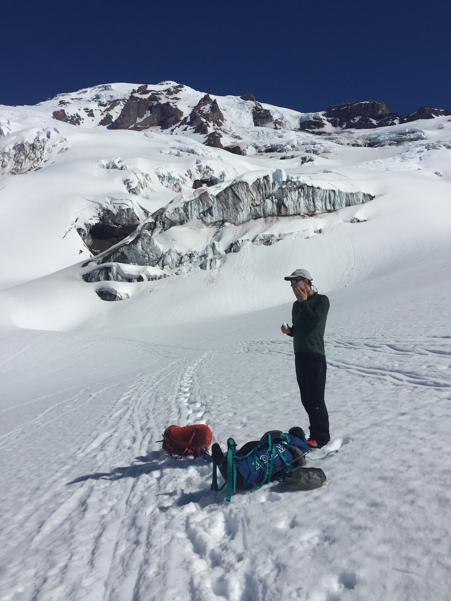  
*Interesting crevasses on the upper Nisqually Glacier. Exposed crevasses were infrequent and obvious, so we did not rope up on the first day of our climb. Credit: Spike Sievert*

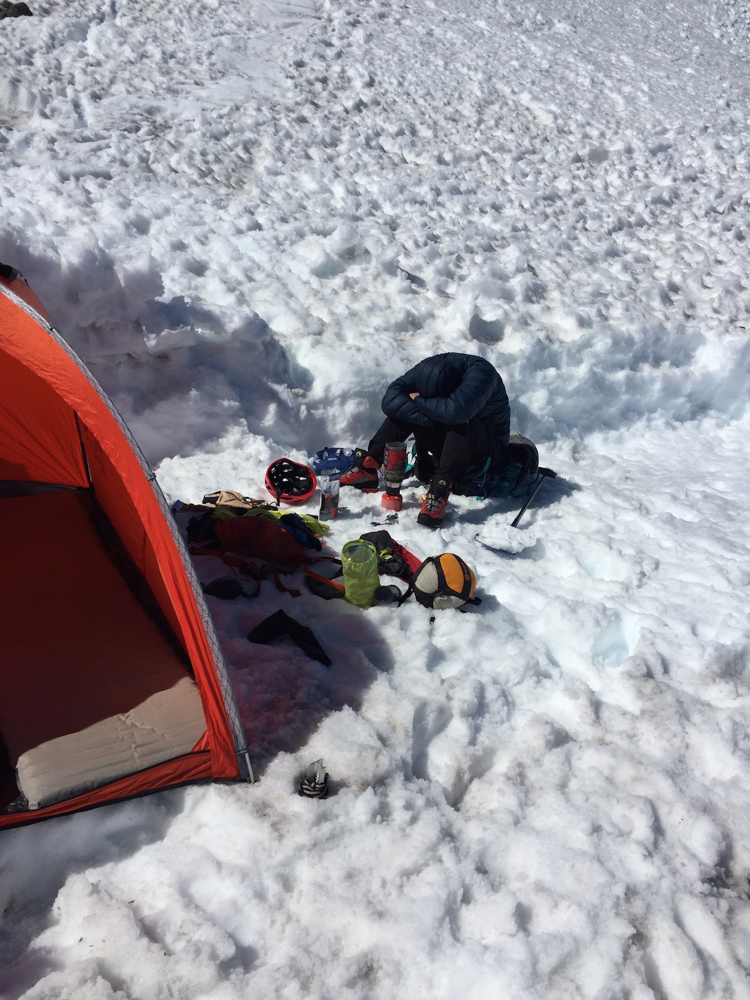  
*Perched over an MSR WindBurner, I endure a hangover-style altitude headache while melting snow. Credit: Spike Sievert*

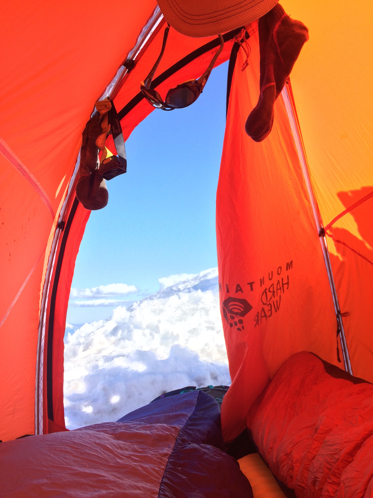  
*We went to bed to clear skies and a My Morning Jacket album*

  
*Tahoma casts a shadow well out onto the Salish Sea while quiet seracs loom above Wapowety Cleaver*

  
*Beginning to feel worked while slogging on the upper mountain. While the Kautz Glacier has trivial technical difficulties, it comprises a little over 9,000ft of elevation gain from the car to the summit. Credit: Spike Sievert*

  
*Summit! Credit: The group with the empty Rainier can*

  
*Beautiful crevasses and rocks on the slopes of the Ingraham Glacier*

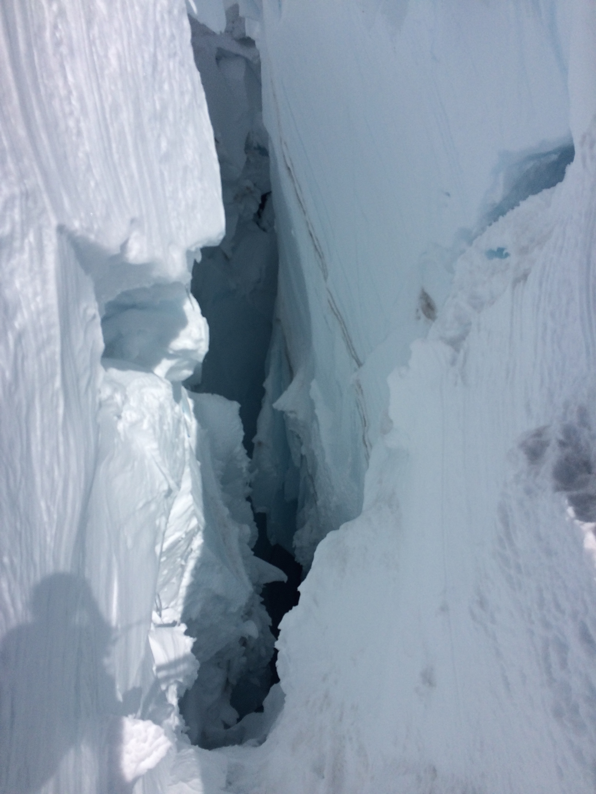  
*One of the crevasses which will soon widen to take the route "out" for the season*

___

**Outer Space Storm with Emma**

After a relaxing day spent with my grandparents in Ballard, I had the good fortune to meet up with my friend and housemate, Emma, for a few days of climbing and socializing. Emma has a lot of experience backpacking and grew up recreating in the Cascade and Olympic Mountains, but was interested in getting a taste of Cascades alpine climbing, since she's recently become keen on outdoor climbing but hasn't had a chance to experience it in her home state. For nearly three years now (principally as the result of Forest McBrian's excellent [2014 Alpinist article](http://www.alpinist.com/doc/ALP47/42-mountain-profile-picket-range) on the area), I've dreamed of going to the Picket Range, and for a moment that dream seemed likely to become a reality. We planned to climb the Challenger Glacier over four days via Easy Ridge and the Hannegan Pass trail. This would have involved skills Emma is already an expert at, namely backpacking and navigating, and some new skills like easy glacier travel and rappelling (off the 50ft summit block). The weather forecast was iffy, but it had been trending towards acceptably mediocre conditions. However, the morning of our departure, I sleepily checked the forecast again just to make sure, and it had changed quite drastically, predicting several days of very rainy weather and thunderstorms. The North Cascades were indeed off the table – and the Picket Range has eluded me for yet another trip!

Climbing in the Cascades in winter had me adequately prepared for this letdown, as I have become well-versed in making detailed plans for alpine routes only to have them trashed by a double-take in the forecast and replaced with a new plan at the last minute. Within a few hours of reading NOAA's NWS forecast, we'd repacked and were heading out of Edmonds for the Enchantments, intent on making the most of what remained in the day by climbing a classic route on the Snow Creek Wall called Outer Space. I called my friend Sylvan for beta on the route, and he let me know that a single rack was indeed not enough to sew up a sustained hand-crack on pitch 5, and that the standard descent would be a difficult onsight in the dark.

After a gigantic speeding ticket on Stevens Pass, a failed attempt to purchase another #1 Camalot, and a quick hike up to the base of the route, we began the first pitch under occasionally gusty winds and overcast skies. The forecast was stable for the afternoon and early evening, but predicted a 50% chance of thunderstorms after 11pm. As we proceeded up the route, enjoying incredibly high-quality and well-protected crack climbing, the skies held out, save for the occasional sprinkle of short-lived rain. Emma came very close to following the crux 5.9+ crack clean, which I thought a very impressive feat for her fourth time climbing outside and first multi-pitch.

However, what I believed would be my crux was yet to come, as I had to climb the 40m 5.8 hand crack with just a single rack. To make matters worse, as Emma approached my belay beneath this pitch, the weather rapidly deteriorated. The skies became dramatically darker in the course of two or three minutes and the winds picked up. Because the Snow Creek Wall faces due east and storms predominantly come from the west in the Cascade Mountains, you can't see what's headed your way from any part of this face. Emma hadn't rappelled before, and we were climbing with one rope, so a quick descent by rappel before the storm hit was out of the question. I decided to commit to leading the hand crack in order to get us beneath a small, sheltered overhang on Library Ledge. The weather continued to worsen as I climbed this pitch as fast as I could. For three or four minutes, life was simply a whirl of sinker hand and foot jams, and the occasional gear placement once the view below me became too uncomfortable. I was desperate to reach the belay before the skies opened up, because despite finding a few nut placements and a fixed #3, much of this pitch was very runout and I couldn't risk blowing a foot-jam on wet granite. I mantled onto Library Ledge, installed a bomber anchor, and threw Emma on belay just as the thunder rolled in and the skies opened up.

If I was introduced to traditionally-protected multi-pitch climbing by ascending a soaking wet hand-crack in a vicious thunderstorm 700' off of the deck in a somewhat remote area, I would have thrown a temper tantrum. However, I'm not Emma. She followed the pitch in style, nearly getting it clean despite blowing rain and several thunderclaps among the loudest I've ever heard. To her left, a contiguous waterfall flowed over granite chickenheads. Above us, two parties topped out the wall onto an extremely exposed plateau. I hid my shoes behind a flake to keep them dry, realizing it might be a bit of a battle to get us safely off the wall.

Emma arrived at the belay thoroughly soaked, and we quickly removed her wet layers and bundled ourselves up in dry synthetics and rain jackets. I was really glad we'd decided to lug up extra layers despite our bet that the weather would hold out. We had also climbed the route at a quick pace up until this point, so we had several hours of daylight left despite starting the approach in the early afternoon. It was around this time that Emma realized we had a strong cell-phone signal, so we called up a few friends and made a really silly [Facebook Live video](https://www.facebook.com/emma.spence.98/videos/10212272639026730/) when the storm began to calm down ("Nobody tell Emma's par–nobody call a rescue, we're totally fine!"). After about an hour, the rain and thunder had subsided enough to justify continuing to climb, and I made a few aid moves through a bouldery 5.9 finger crack to mitigate the risk of falling near the belay on a slippery rope, and brought Emma up. We leisurely, though quickly, finished up the final two pitches and popped out on top of the wall just as it began to get dark. The standard descent, as described in Blake Herrington's Cascades Rock, "has been the site of many serious accidents, mostly due to rocks kicked off or climbers stumbling over small ledges." I also knew that it consisted of a bunch of sketchy 4th class - Sylvan and Spike did it in the dark last summer and said it sucked. The only remaining option was to descend north down a vague ridgeline and drop into the Snow Creek drainage to regain the trail from the parking lot. If there ever was an established climbers trail for this route, we immediately lost it, and it started to become very dark. We began to descend through a sinister burnt forest full of loose rocks, widowmakers, and downed logs. 

As we entered this terrain, I insisted we put our helmets back on and made sure to emphasize that this was dangerous going, since Emma hadn't bushwhacked on stuff quite like this before. My call on helmets turned out to be a good one, because I broke a stump while downclimbing a steep bit of third class and it fell straight on my head, cracking my new helmet nearly in two and leaving me with a few scrapes and bruises. We eventually dropped into the Snow Creek drainage, arriving at a roaring river amidst dense river brush, where you have to engage in a slow-motion bar-fight to move even a foot or two. It was now pitch black, and it was abundantly clear that the consequence of falling into the river would probably be ultimate. We scouted a few crossings but none of them seemed suitably safe. I mentally prepared to spend several hours 'shwacking our way around until we found a safe log, but fortunately within a half hour we found a good one and sketched our way across. We scooted down the Snow Lakes Trail and arrived back in Edmonds just after 2am, worked and covered in various products of the Cascades ecosystem.

In retrospect I think we made good decisions, and just got fabulously unlucky with the weather. Should the forecast have proved correct, we would have topped out the route around 7:30pm, allowing us nearly two hours of usable light to navigate the descent in dry weather. I think once it became clear that it was going to storm, we also made the right call to get to a sheltered place on the wall and wait for it to pass rather than negotiate a tricky rappel descent or, as the other parties on the wall did, top out on a barren, pointy ridge in the midst of frequent and proximate lightning. However, our journey back to the Snow Lakes Trail reiterated for me how dangerous loose, steep bushwhacking is. On a descent like this, one is forced to make dozens of small bets a minute - that a rock will hold, a grabbed bush will not break, or a stretch of dirt will not slide excessively when weighted. When the bets go bad, you can usually recover by weighting other limbs or leaning into the slope. Despite this rapid-fire process of betting on features you don't have time to thoroughly evaluate, I have always felt in control and relatively comfortable in this type of terrain. However, the broken stump changed that somewhat. I knew it was flexy and burnt and planned to limit the weight I applied to it as I used it for support on a steep sandy bit. Even when it broke off, I still felt like I could slow my fall. But then, as a foot slipped and I began to slide down the slope with the broken stump crashing down on top of me, I felt a brief moment of panic as I accepted that I didn't know what was about to happen. I'm glad I sustained no significant injuries from this episode, and got to experience firsthand what can happen in this type of terrain without paying much of a cost. Helmets, relative to what they protect, are practically free.

We slept in the next day and eventually drove over to Darrington to climb a mixed slab route called Total Soul. Not much to say here, because everything went incredibly smoothly. Emma did an even better job than last time managing a multi-pitch belay and did quite well on several tricky 5.9-5.10 slab cruxes. We made around six double-rope rappels to get off just as the sun went down and enjoyed, for once, a nice and uneventful evening of climbing in a beautiful, empty wilderness area. The next night, we met up in Kirkland with Riley and Spike's family at his uncle's bicycle-themed brewery, Chainline Brewing Company, and later reunited with more friends from our university climbing team at a bar on Capitol Hill. Through confusing circumstances, we were joined at the bar by two very drunk men from Snohomish, who interspersed truly concerning bits of misogyny with unforgettable drunken antics such as a poorly thought-out rant about Capitol Hill's club scene ("It needs to have, like, dancing, you know?"), and a hazy plan to utilize a private BMW car service to shuttle themselves back home. The whole experience felt very similar to scenes from the movie Fear and Loathing in Las Vegas, and I briefly reimagined myself as Raoul Duke, swimming through a bar full of scaly reptiles with several tabs of acid under my tongue.

  
*Preparing to Devastate the Environment below the Snow Creek Wall. Credit: Emma Spence*

  
*Emma enjoys her first hanging belay beneath the fourth pitch of Outer Space*

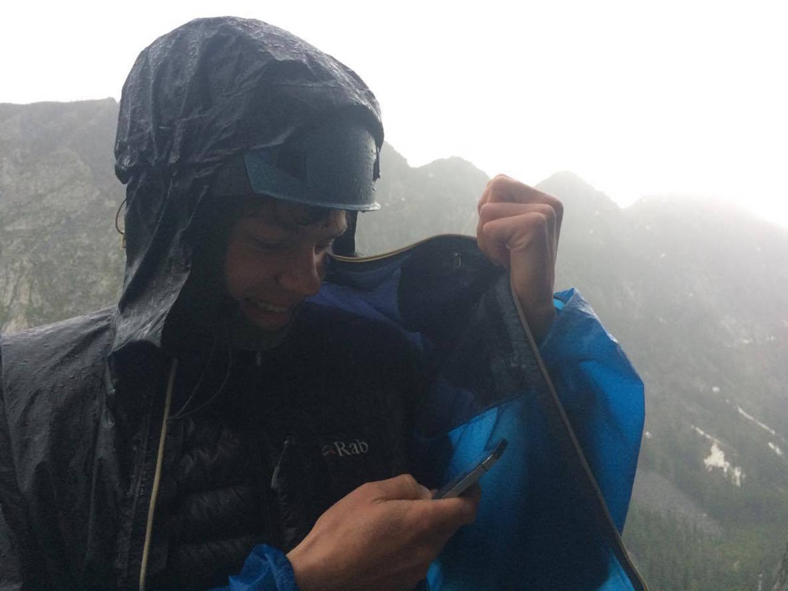  
*"Wait, we have LTE!?" Millennials contemplate their first-ever Facebook Live broadcast. Credit: Emma Spence*

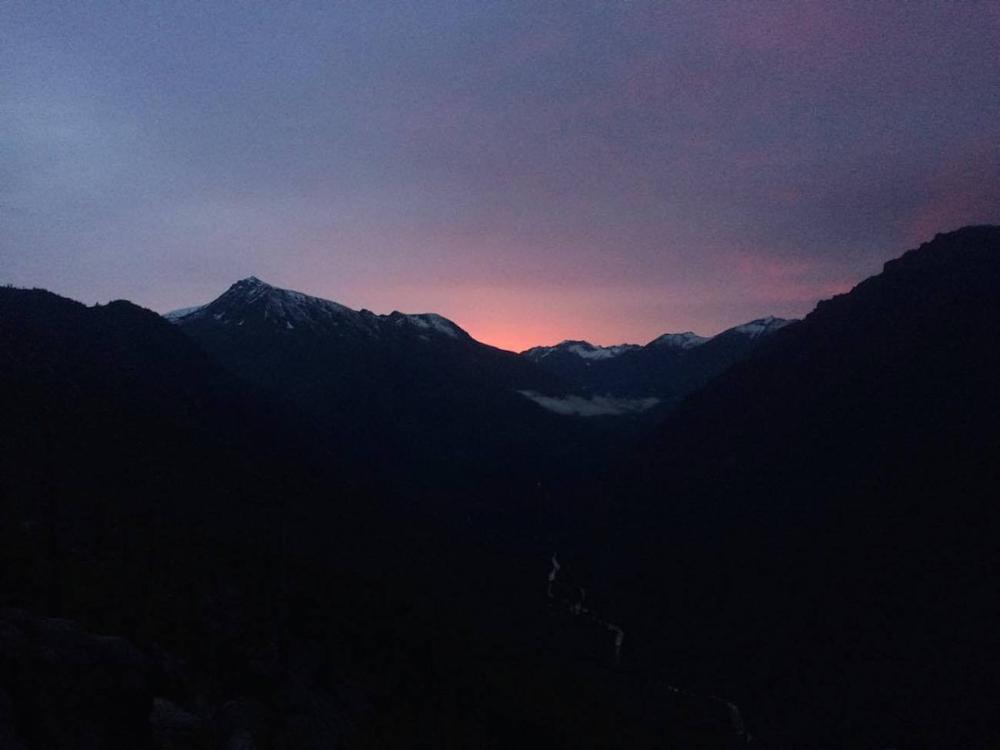  
*The light fades as we begin an extraordinarily unpleasant descent. Credit: Emma Spence*

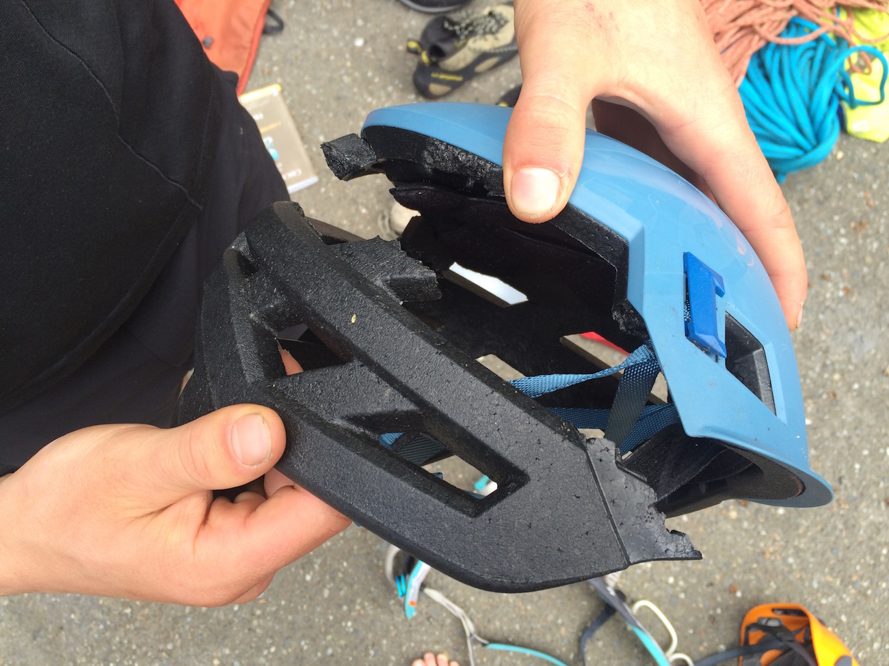  
*Damage to my helmet*

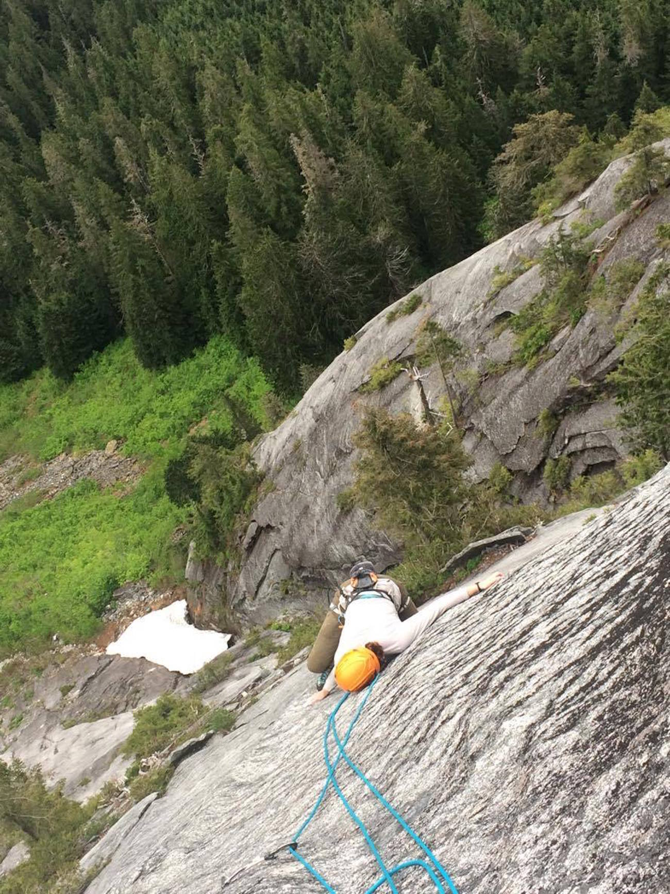  
*Emma works her way through her first 5.10 slab crux on Total Soul*

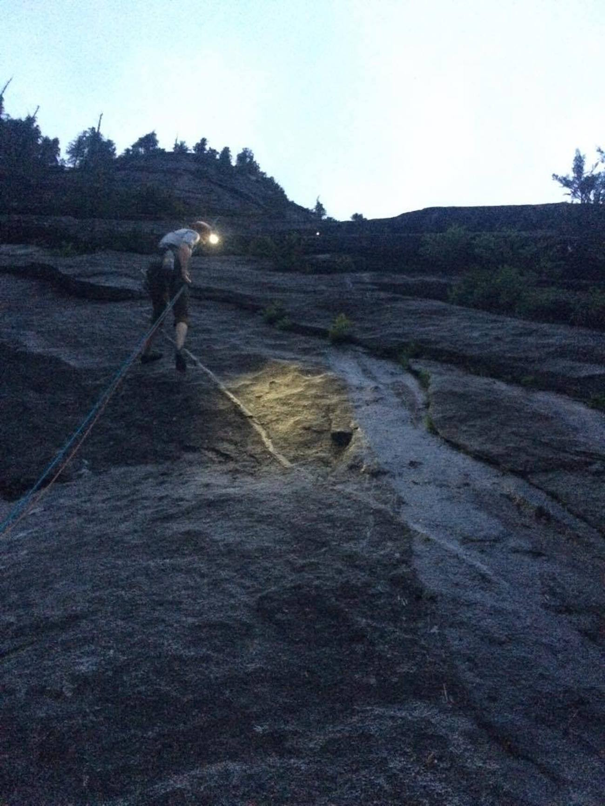  
*Emma finishes the last of several double-rope rappels from Total Soul just as the sun goes down*

___

**Mount Stuart, Aasgard Pass Tragedy, and Acid Baby with Riley, Ilana, and friends**

The following morning, Riley and I said goodbye to our friends Libby and Grace and boarded the "Endurance 2" for Leavenworth. Unbeknownst to me, his previous vehicle, a 300,000+mi Subaru known as the "Endurance," had blown its transmission while returning back to Oregon after our last Cascades trip in March. He'd somehow managed to sell it, to a pot farmer nonetheless, for $1,200. The "Endurance 2," an old 'Yota SUV, was then purchased from a curious character who resented the associations it held with his ex-wife. (Apparently, until Riley removed them, there were steel testicles mounted on the front chassis.) Unfortunately for Riley, I hold some sort of curse over his vehicles, and the "Endurance 2" failed to start after being pulled over by the police on Icicle Creek Road. The officer, who had just issued Riley a warning, circled around to find the two of us under the hood, ruminating about what had gone wrong. From behind dark sunglasses, he called out: "Need any help?" Riley, a seasoned motorsports enthusiast and mechanic extraordinaire, kindly declined his offer, and in any case, the "Endurance 2" roared to life a minute later.

We decided to attempt the North Ridge of Stuart, expecting a good challenge: the route was still very much in spring condition, with the upper mountain covered in a not-insignificant amount of snow. Riley and I both want to make an attempt on it in winter one day (certainly the biggest prize in winter climbing in the Stuart Range), so climbing it in this condition would offer a gentle preview of what to expect when the entire climb is covered in snow. Unfortunately, we woke up below the ridge and Riley quickly realized that an overuse injury in his hip was flaring up big-time. We hemmed and hawed for a while about what to do, eventually deciding to climb the first half of the ridge, and then bail out to the Stuart Glacier via a couloir, and descend. However, just 30 feet from the toe of the ridge, Riley made the call that his hip was simply hurting too much. Especially since he was days away from working a 35-day NOLS course in the Waddington Range (hiking, not flying, into the remote range), it obviously made no sense to go for it and further mess up his hip. We descended back to our bivy, hung out for a few hours to enjoy the serene morning ambiance, and then drove back to Seattle later in the day, both of us quite disappointed but glad to have made the right call.

Riley and I parted ways and the final phase of my trip began: my friend Ilana had been lucky enough to get her hands on a 6-person, 5-day permit for the Colchuck Lake zone of the Enchantments, and was gracious enough to invite me to join her for it. After some last minute shopping and packing, we departed the next morning in her friend Shomari's car for Leavenworth, very stoked to have four days of A+ weather forecasted. In the trunk was the heaviest pack I've ever carried: in addition to five days' worth of food, I carried steel and aluminum crampons, a rock rack, a rope, skis, two ice tools, rock shoes, and a tent, pad, and bag. I'd never basecamped like this before and wanted to have all my options open for five days in alpine paradise, and the excess equipment turned out to be well worth the weight.

Down in Leavenworth, we met up with Ilana's friends Sean, Abbey, and Amanda and made off for the trailhead. The going was slow on the hike up – Ilana and I, owing to our gear, looked like junk shows and had to maintain an excruciatingly conservative pace in order to not burn ourselves out before we even got on any routes. I arrived at the lake before the rest of my group, and scouted around for a campsite, finding a really beautiful one at the south end of the lake. Then, things took a turn for the tragic.

I started hearing some shouts, which were coming from around Dragontail and Aasgard Pass. They didn't sound like climbing commands, but I couldn't quite make out what was being said. I decided to skin up the Colchuck Glacier a little bit to see what was up, and also test out some modifications I'd made to my ski setup. I never saw who had been yelling and the noise stopped, so I skied back down and was beginning to hike back to the north end of the lake when I ran into a group of hikers who informed me that someone had glissaded into a "hole" in the snow on Aasgard Pass, a 2500ft snow slope which extends from the Enchantment Plateau down to the southeast end of Colchuck Lake. I'll never forget the following few minutes. I turned around to look at the Pass, and my eyes instinctively focused in on a waterfall in the dead center of the slope. It had been the site of two fatal accidents in the last five years and one other very close call in 1998 – all from people glissading over the edge of the waterfall and into the sub-snow-surface hole it carves each year under the snowpack. To my utter horror, a new glissade track which hadn't existed when I saw the waterfall an hour prior went from several hundred feet above the hole, down the fall line, straight into the waterfall.

I knew this person was dead or near death, and began to consider if I could do anything to help them. I had with me a 60m 6mm static rope, two ice tools, an ATC, two Petzl Micro Traxions, and a Petzl Tibloc, and I have experience building snow anchors, hauling and ascension systems, and treating patients within the EMT scope. Certainly, I could have done something. However, as I pondered my options, I came to the conclusion that attempting a rescue was folly, given the situation. I'd been told that the first responders hadn't been able to establish contact with the person who'd fallen in, which meant that they were either dead, unconscious, or too far down for their voice to carry above the waterfall and the acoustically insulating properties of the deep snowpack they were entombed under. I also knew that the only way to quickly help them would be to climb to the location (~1 hour), build some sort of an anchor in the soggy afternoon snow, rappel into 33F water on an extremely skinny rope, and, if the victim was alive, attempt to extricate them quickly enough before they succumbed to hypothermia and probably numerous life-threatening injuries. This would certainly have put myself at great risk, and I wasn't willing to take a risk like that when I already felt it unlikely that the victim had survived the accident or had survivable injuries. Search and Rescue had been contacted via a satellite phone, and I continued hiking back to meet my friends, upset that there was nothing I felt I could reasonably do. It was particularly crushing that yet another person probably lost their life falling into the same, widely-publicized snowpack hazard which forms on that slope every single spring. We passed the rest of the evening trying to lighten the mood as birdsong mixed with the whirl of military helicopters transporting Search and Rescue personnel to and from the scene.[^20]

[^20]: As of June 12th, the recovery attempt has been [called off](http://www.yakimaherald.com/news/state_news/search-suspended-for-man-missing-on-aasgard-pass/article_875b15a6-2c2f-11e6-8647-c7f84aac23de.html) until more snow melts from Aasgard Pass. Discussion on this accident can be found [here](http://cascadeclimbers.com/forum/ubbthreads.php/topics/1155031/Another_Aasgard_Pass_incident#Post1155031), and a discussion of an identical accident, including a harrowing near-miss, is [here](http://cascadeclimbers.com/forum/ubbthreads.php/topics/1149154/Possible_Fatality_on_Aasgard_P).

The next morning Ilana and I set off to attempt Acid Baby on Aasgard Sentinel, a 7-pitch route offering sustained 5.9-10+ crack climbing and a knife-edge ridge topout. It was a pleasure to finally be on high-quality alpine rock with a solid forecast, after the events of the previous week. I barely onsighted both of the cruxes – the first a "place, crank, or fall"-type hand-and-fist crack and the second a smeary, RP-protected stemmy seam – and turned over the lead to Ilana after four pitches. About a third of a pitch through her block, she lowered off, understandably psyched out in the aftermath of an ankle surgery and the resulting dip in the amount of time she'd been spending on the rock over the last few months. I felt a little worked from all the climbing and rope management of the previous pitches, but couldn't complain too much about the privilege of leading several more pitches of splitter granite! I reassumed the lead and took us to the top, the final pitch comprising a fantastically-exposed and solid knife-edge arete. However, we really had to put the gas on at this point. Our snafu with switching leads had cost us a lot of time, and Ilana had dropped her crampons off the route. If the snow solidified with the setting of the sun, we would be in a tricky situation given that we only had a single pair of crampons, and Ilana had much less experience on snow than I do. I belayed her up and down a few sections of steeper snow, and we chose the most conservative route possible descending Aasgard Pass, arriving back just after dark.

I walked alone through the dark forest bordering Colchuck Lake towards camp, and let myself fully acknowledge the stress of the last seven days: I'd guided my friend up a wall in a storm, endured a heinous descent, bailed at the base of the climb I wanted the most, made a rapid turnaround in Seattle, witnessed the aftermath of a horrifying death, and pushed through a longer-than-expected day, and it was all starting to take its toll on my psych. Often on alpine climbing trips, and in life, it's easy to push away or leave unacknowledged the effects of chronic stress for a little while, only to have this bite you in the ass down the line when you find yourself feeling unmotivated and negative for no apparent reason. I admitted to myself that the last week had been kind of insane and that I needed to take a break lest I lose motivation for the last few days of the trip. That night, I was too exhausted to make it into my tent or even rehydrate myself after a long day out. Someone offered me a single sip of whiskey, and the next thing I knew I woke up on an uncomfortable rock at 9am.

  
*Riley poses next to his new house, the mighty Endurance 2*

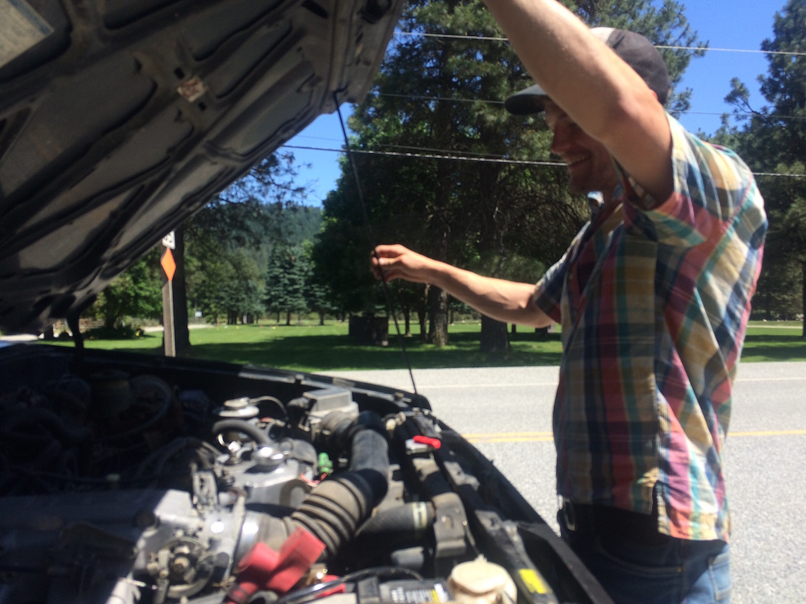  
*The Endurance 2 not feelin' too good after getting a stern warning from local law enforcement*

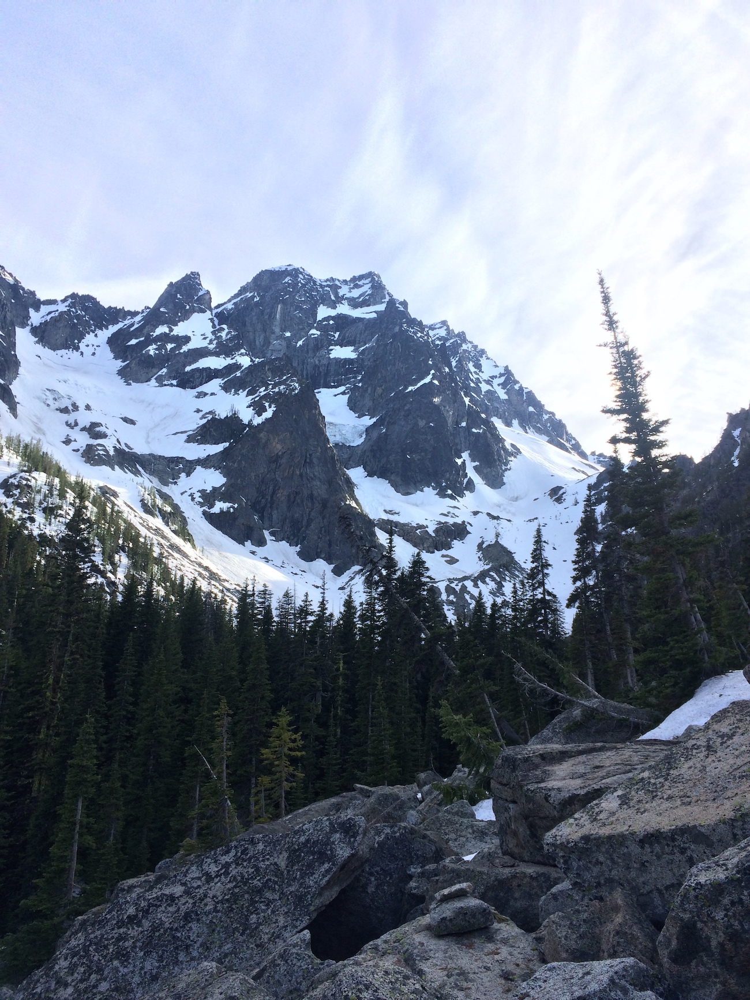  
*You only get one opportunity to see a place for the first time. My first peek at Mount Stuart.*

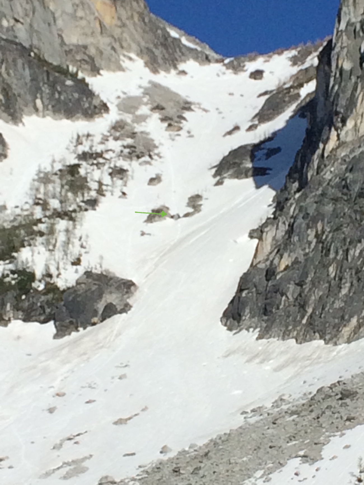
*The fatal glissade path on Aasgard Pass*

  
*Three amazing Cascadian peaks, holding 15+ routes each: Dragontail, Colchuck, and Stuart arranged left-to-right*

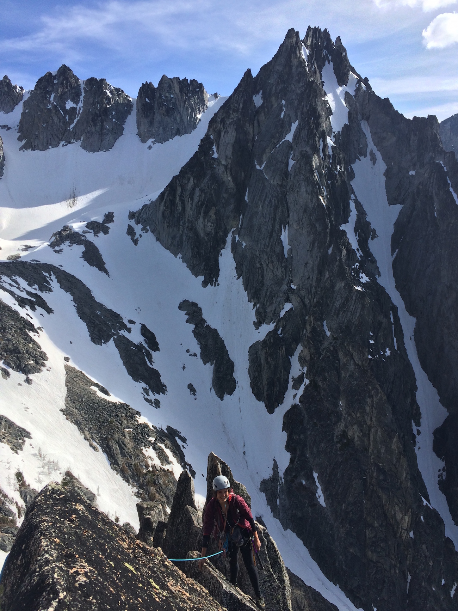  
*Ilana enjoys fun, exposed climbing on the last pitch of Acid Baby, with the Northeast Face of Dragontail Peak behind. The Northeast Couloir winds its way down the right side of the photo.*

  
*Moonlight crowns the 3000-ft North Face of Dragontail Peak*

<iframe src="https://player.vimeo.com/video/221349040" width="640" height="361" frameborder="0" webkitallowfullscreen mozallowfullscreen allowfullscreen></iframe>

___

**Solo in the Enchantments: Colchuck Col Buttress, Colchuck Glacier, and Colchuck Peak**

The rest of the group was leaving to go back to Seattle, whereas I would be spending the next two days at the Lake, the first one by myself. I decided to take the morning as slow as possible, and walked like a sloth back to my tent, where I prepared a gigantic egg breakfast at glacial pace. Satiated, I sat in my tent perusing photographs of the Beckey guide and eventually settled on an objective for the afternoon: skin up the Colchuck Glacier, and attempt a solo of the rarely-climbed Colchuck Col Buttress via a short 5.6 route. Then I'd return to my skis, and ski the Colchuck Glacier back down to camp.

I left just before 2:00pm and promised myself I'd assume a really conservative mindset for the day: this was my first time doing honest backcountry skiing (on a really poorly-performing ski setup, nonetheless), and the first time I'd planned to solo an alpine route in almost two years. To top things off, I was by myself and nobody knew my plans, since there was no cell reception. I skinned up the glacier, enjoying fabulous views of the gigantic northwest face of Dragontail, focusing on taking a chill pace and enjoying myself. I left my skis 600' below the top of the glacier, knowing I wouldn't be comfortable skiing the upper 40˚ slopes. Then, I proceeded up a snow gully for about 500' to what I believed was the summit block of Colchuck Col Buttress. However, I arrived at its top via nothing harder than easy class 4 scrambling, and knew that I wasn't in the right place, since the route was rated 5.6. Not too far from me was another summit of approximately equal height but sheerer proportions. I made my way over to it, and the only way to the top was an extremely grainy flake, to a slightly overhanging hand crack which lead to easier scrambling. I might have been comfortable soloing it, but the rock wasn't good enough, so instead I built an upward-pull anchor off of a thread and a good cam, and got out the rope I'd brought. I tied one end to the cam and thread, flaked the rope carefully, and tied in with a clove hitch 20' from the anchor. I stepped off the ground to begin my first-ever rope-solo. The pitch, perhaps 50' in length, protected well with the minuscule rack I brought, consisting of four cams and eight nuts. The climbing was no harder than 5.6, and everything felt surprisingly safe. I topped out perhaps 3.5 hours after leaving camp, built an anchor off a nut and a thread, and rappelled back down, cleaning my gear as I descended. I very carefully downclimbed the couloir, which was baking in the sun, and arrived back at my skis for the last component of an exciting and adventurous day.

My highly-improvised ski setup is not very releasable: not only are my knees secured to the tips of each ski via a tensioned cord, the front of each toe is secured to the binding via ski straps! Falling on terrain with any sort of unsafe runout is a big no-no, so I knew I had to choose mellow lines, keep my speed low, and remain extremely attentive to runout and hazards on the slope such as small rocks and undulating piles of wet slide debris. I skied with an ice tool in one hand to facilitate arresting should I have fallen. After a few turns, I started to feel really dialed into my crappy ski setup, and began to have more and more fun as I made turns down the crevasse-free glacier. Before I knew it, I was back at Colchuck Lake, hooting and hollering with delight! Feeling quite satisfied with my afternoon, I went back to camp and cooked myself a huge couscous dinner.

Steve would be meeting me at my tent sometime after 5am and I still wanted to get one more solo done before he arrived: the North Buttress Couloir of Colchuck Peak. I'd been eyeing this line for a few days and had even gotten some beta on the route from a couple skiers I'd run into on the day of the accident. I woke up at 1am to begin the solo, having packed everything the evening before, but as soon as I stepped onto the snow I realized it likely was a no-go. Even despite a clear sky, the snow was nowhere near refrozen. I hiked up another 1000', hoping that colder temperatures higher up might have resulted in a refreeze, but the snow was not appreciably different. I wanted nothing less than rock-hard snow for this route, since I'd be climbing ropeless and had watched a naturally triggered wet slide pour down the route the prior afternoon, and so it was obvious that I wouldn't be climbing the route that day. I jogged back down to my tent to get some rest for what I suspected would be a long day with Steve.

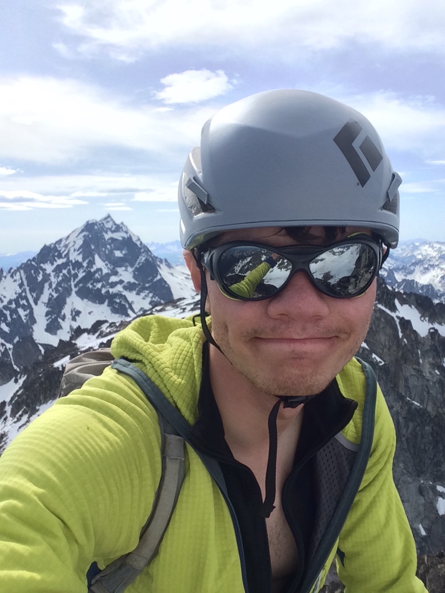  
*Self-portrait on top of what might be Colchuck Col Buttress*

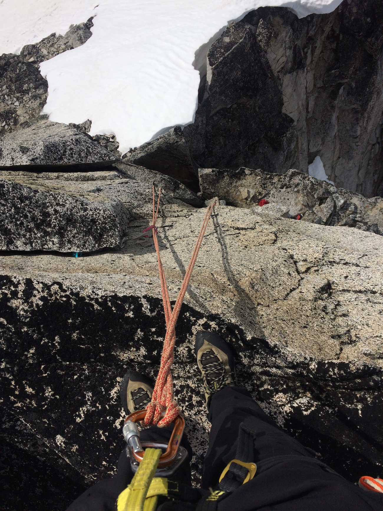  
*Atop the summit block, looking down at my rope-soloing system. I climbed on an Edelrid Rap Line II, which is UIAA-certified as a twin, so I had to climb with the rope doubled-up.*

  
*A panorama I tried to take of the gigantic Northwest Face of Dragontail Peak*

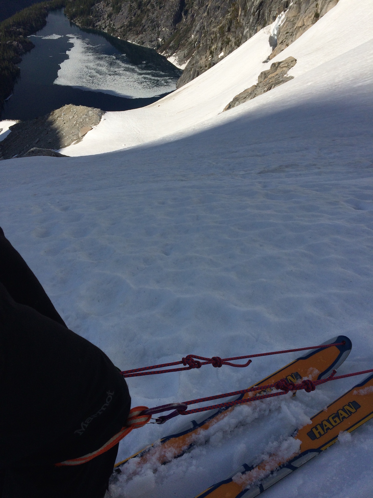  
*Beginning my descent of the Colchuck Glacier with the seedy ski setup*

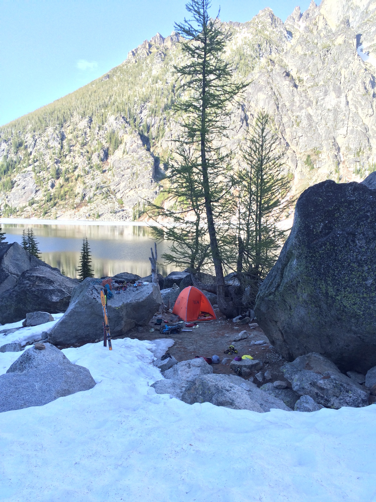  
*Home sweet home at Colchuck Lake*

___

**West Face of Colchuck Balanced Rock with Steve**

"Marcus!" "Yooooooooo!" I opened my eyes to find my friend Steve hovering directly above me, having spent the last three hours hiking in from the parking lot to meet me in alpine-land. The feeling of waking up in one of most beautiful places in the world to the sight of a friend you haven't seen in almost a year is an unforgettable one. A sense of epic rock quickly overtook us as we downed instant coffee mixed with soggy couscous and planned the day's adventures, and within an hour we were departing for Colchuck Balanced Rock to attempt the West Face, a stout and sustained 5.11 route with stellar climbing and a summit that consisted of a peculiarly-balanced boulder.

We racked up at the base of a loose 4th-class approach pitch, and I was glad we'd belayed it when Stephen loosed a double-microwave-sized boulder while following my delicate and poorly-protected lead. The boulder whizzed down the route, jumped over the protected nook from which he had been belaying minutes earlier, and eventually came to a rest in the snow below the face. Sheesh. A few hundred feet later, Stephen gave it his all on the first of three crux 5.11 pitches: a beautiful dihedral covered in neon and red lichen which I couldn't stop being fascinated by. He took a few whips to get up, I nearly followed clean, and he got to experiment with our pack-hauling setup: since we had to approach and descend the route in heavy mountaineering boots, it was advantageous to haul a small daypack up the route to facilitate climbing the harder pitches, and the chimneys, without a backpack.[^1] This pitch deposited us directly under the largest roof I've ever seen, and the next pitch consisted of traversing a crack with smeary feet to escape it. Unfortunately, this pitch was stinking wet, so I made a few aid moves to get through it. Similarly, Stephen pulled on gear through the crux 11c boulder problem on the next pitch, which rested above the most beautiful pitch of 5.9 I've ever climbed: an immaculate corner with occasional rests, covered in more of the amazing lichen. More pack hauling, and a prussic through the crux. Stephen relinquished the lead after two heinous "5.8" chimneys which have since been upgraded in Blake's guidebook to 5.10b, and I took us to the top via perhaps 90m of simulclimbing, protected by a Micro Traxion on a solid horn. We took turns belaying each other up the Balanced Rock itself, via an unprotectable V1 boulder problem that felt more like V2 with its high-consequence landing zone of a narrow, boulder strewn ridge.  The Balanced Rock fortunately showed no signs of falling off despite how precariously it appears perched from a distance.

Our success on the route masks how much like a battle the whole thing felt. To attain the summit, we had to tiptoe our way up scary fourth class, run full-rope pitches of sustained 5.9 climbing, tackle a wet 5.11 dihedral, haul a pack for the first time, aid our way out of a cramped and dripping roof, battle through heinous chimneys, and finally descend some soggy, somewhat steep snow to get back to our larger packs, and down to camp. It was a huge relief to get back to the lake just as it got dark and exchange a hug, knowing we'd officially finished the climb and could let our guard down. Despite the fact we came nowhere close to freeing the route and instead climbed it at 5.11a/C1, it felt great to be faced with such a diverse set of problems and still end the day with the route feeling like an appropriate challenge for our abilities, rather than a near-epic. Determined to minimize weight on the hike out the next morning, I cooked nearly all of the remaining food I had with me, and we enjoyed a gigantic meal of fried eggs, zucchini, onions, peppers, and chopped kale stems served over brown rice, garnished with peanuts and raisins, and followed by fists of M&M's, and nutella tortillas. The next morning, it was raining, and via tent-to-tent radio we affirmed our collective desire to get out of there and down to Leavenworth, where we could enjoy good coffee and a prepared meal. The hike out was brutal on the knees, but I couldn't complain, since the weight of my pack had allowed me to live in a beautiful place with all the food, gear, and creature comforts I could have wanted for the better part of a week. For anybody who feels a little burned out on the in-n-out, fast-n-light approach to alpine climbing, I encourage you to pop a few ibuprofen and haul your war chest up to whichever cirque captures your imagination the best, and once there, sit back and enjoy the place as a temporary home, rather than a looming unplanned bivouac.

I'm a little over a half-day away from my flight back to Connecticut, where I will spend the rest of the summer working full-time, so I'm already preparing myself for a bout of PPNWD (post-Pacific-Northwest-depression). I'm incredibly grateful to have been able to spend time with friends, many of whom I won't be seeing for a while, and appreciate the essence of alpine climbing, elegantly captured by Dougal Haston as "overcoming and watching others overcoming."[^2] I can't wait to return this winter to make some attempts on old projects and open up some new ones!

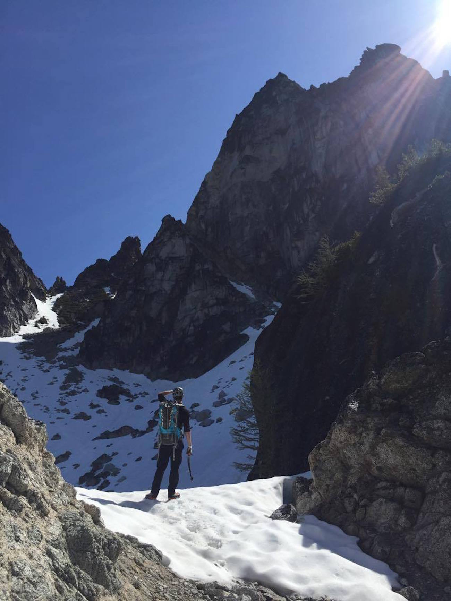  
*Gaining the approach pass; Colchuck Balanced Rock looms overhead. Credit: Stephen Snell*

  
*Beautiful rock to the left of the first pitch of the West Face. Shortly after, we knocked a huge boulder off the route.*

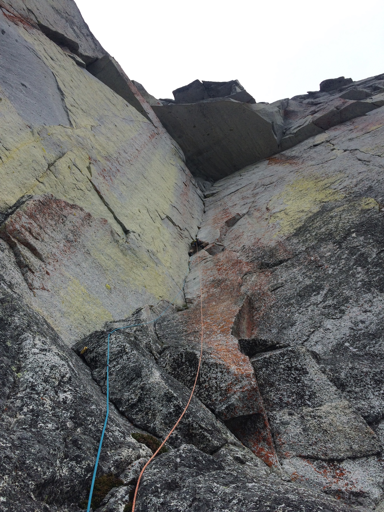  
*Steve gets into the business of the excellent 5.11a corner; the next pitch traverses leftwards under the roof*

  
*Jamming my way towards Steve's belay. This pitch had an awesome rhythm of hand-finger-hand sequences mixed with the occasional layback and smeary rest. Credit: Stephen Snell*

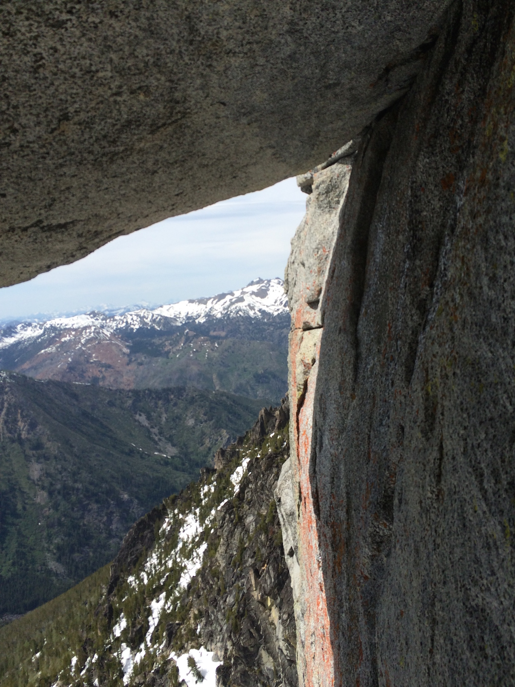  
*The cramped traverse underneath the roof*

  
*Sorting out a rope snafu while aiding our way around the roof*

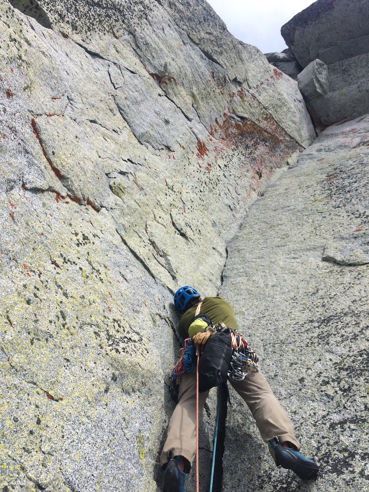  
*Steve heads into the crux pitch of the route*

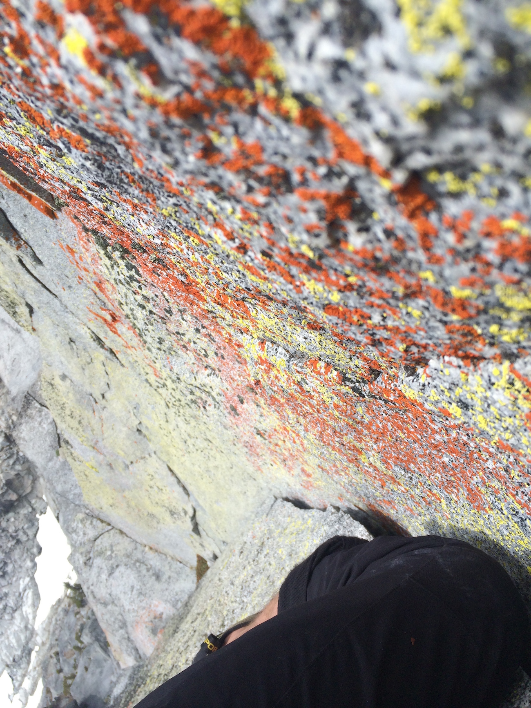  
*Incredibly radiant lichen clinging to the sides of an excellent 5.9 hand crack*

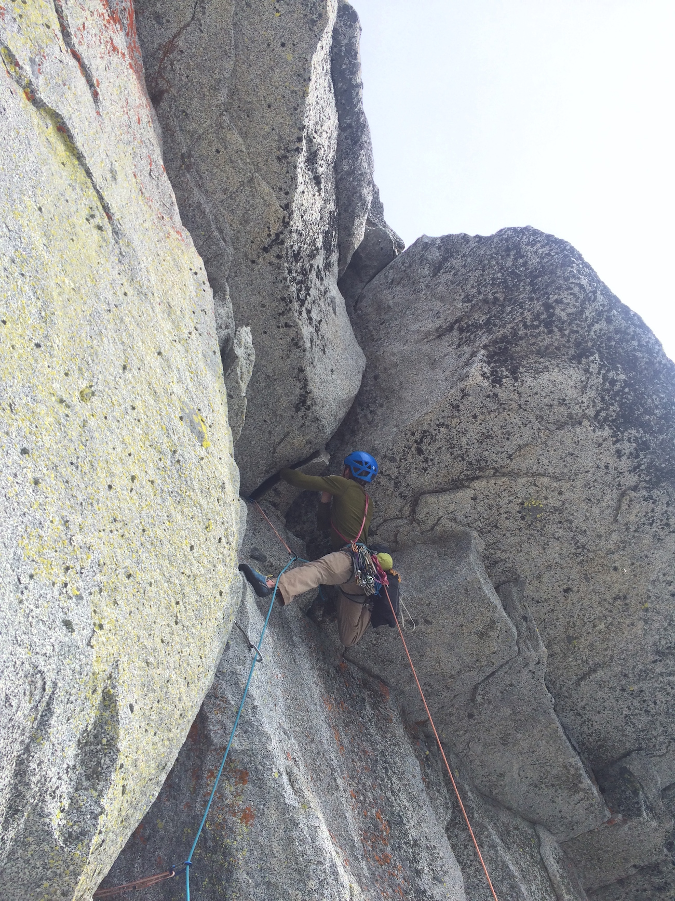  
*Steve goes to battle with some very sandbagged chimney climbing*

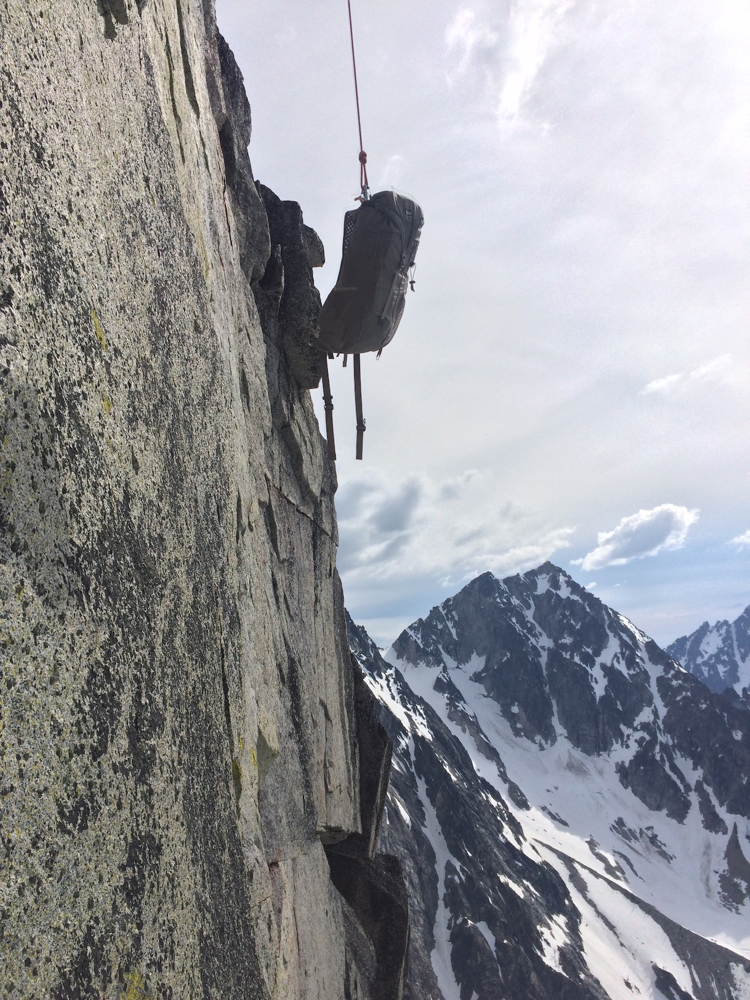  
*The bag prepares to get thoroughly stuck in the chimneys above. This face is STEEP! The Northeast Face of Colchuck Peak looms behind.*

  
*A beautiful Cascadian sunset. Mount Stuart is on the left.*

[^1]: We used a 6mm tag line, a Micro Traxion, and a Tibloc (to facilitate doing the haul with feet, rather than arms). This worked quite well as a lightweight hauling setup, however putting a rotor swivel on the bag would have reduced twists in the tag line rope, which later on caused some problems.

[^2]: I originally read this quote in Mark Twight's seminal book from the '90s, "Extreme Alpinism: Climbing Light, Fast, & High." To my surprise, I recently discovered that in 1983 Mark Twight nabbed the second ascent of the West Face of Colchuck Balanced Rock! The only other Cascades route with Twight history I know of is a either a [death route](http://cascadeclimbers.com/forum/ubbthreads.php/ubb/showflat/Main/10350/Number/140726) or a [fine alpine challenge](http://colinhaley.blogspot.com/2009/01/watusi-rodeo.html), depending on who's writing, so I guess it's cool to experience a shared history without getting on a gigantic Norwand in winter.

